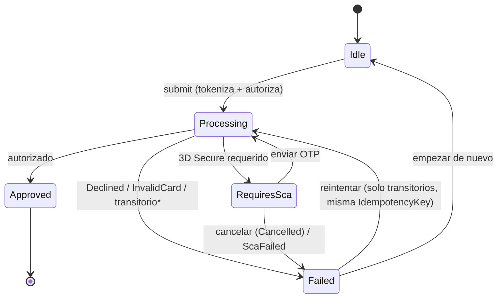

# CheckoutKMP

Flujo de checkout y pagos en Kotlin Multiplatform: tokenización, 3D Secure (SCA), idempotencia, reintentos, accesibilidad y tests de lógica compartida. Lógica en commonMain, UI Android en :androidApp.

> Proyecto de prácticas centrado en el **dominio de pagos**. El objetivo es demostrar
> una arquitectura limpia, testeable y segura (PCI-consciente) para un flujo de pago real,
> con la lógica compartida en `commonMain` y la UI únicamente en Android.

---

## Arquitectura

Clean Architecture con la lógica de negocio 100 % en Kotlin común (sin Android):

```
┌──────────────────────────────────────────────────────────┐
│  :androidApp   (Compose + MVI)                             │
│  UI · estado inmutable · intents · ViewModels              │
└───────────────▲──────────────────────────────────────────┘
                │  consume casos de uso
┌───────────────┴──────────────────────────────────────────┐
│  :shared / commonMain                                      │
│                                                            │
│   domain/   Modelos puros, PaymentState, casos de uso,     │
│             Luhn, caducidad, y los CONTRATOS               │
│             (PaymentRepository, CardTokenizer).            │
│             No conoce Android ni frameworks.               │
│                                                            │
│   data/     IMPLEMENTACIONES: FakePsp, FakeCardTokenizer   │
│             (PCI-safe), repositorio + retry, idempotencia  │
│             por IdempotencyKey.                            │
└──────────────────────────────────────────────────────────┘
```

- **domain** no depende de nada de la plataforma: modelos inmutables, casos de uso puros,
  la máquina de estados y los **contratos** (`PaymentRepository`, `CardTokenizer`).
- **data** implementa esos contratos (PSP simulado, tokenizador PCI-safe, repositorio con reintentos).
  Regla de dependencia: `data → domain ← presentation` (nada apunta hacia data).
- **UI** (solo Android) sigue **MVI**: estado inmutable + intents, alimentado por los casos de uso.
- **DI** con **Koin** (KMP en `:shared`, `koin-android` en la app).
- Targets **iOS activados** (`iosArm64` + `iosSimulatorArm64`, framework `Shared`). `commonMain` es
  agnóstico de plataforma, así que no necesita `iosMain`. La compilación/enlazado de los targets Apple
  **requiere macOS + Xcode** (en otros hosts Gradle los configura pero no ejecuta sus tareas nativas).

## Módulos

| Módulo        | Contenido                                                            |
|---------------|---------------------------------------------------------------------|
| `:shared`     | Lógica compartida: `commonMain` (domain + data), `commonTest`, `androidMain`. |
| `:androidApp` | Aplicación Android con Compose y patrón MVI.                         |
| `iosApp`      | App SwiftUI nativa que consume el framework `Shared` (targets iOS activados). |

### Stack

- Kotlin Multiplatform (Kotlin 2.4, AGP 9) · Gradle version catalogs (`gradle/libs.versions.toml`)
- kotlinx-coroutines · kotlinx-datetime · Koin
- `kotlin.uuid.Uuid` (stdlib) para `IdempotencyKey`
- Tests: kotlin-test · kotlinx-coroutines-test · **Turbine**

## Cómo ejecutar

Requisitos: JDK 17+, Android SDK (definido en `local.properties` → `sdk.dir`).

```bash
# Compilar la app Android
./gradlew :androidApp:assembleDebug

# Ejecutar los tests de la lógica compartida (host JVM)
./gradlew :shared:testAndroidHostTest
```

En Android Studio: usa las run configurations del widget de ejecución.

**iOS (requiere macOS + Xcode):** abre `iosApp/iosApp.xcodeproj` en Xcode y ejecútalo; el build embebe
el framework `Shared`. También puedes compilar la lógica para iOS con
`./gradlew :shared:linkDebugFrameworkIosSimulatorArm64` (solo en macOS) o correr sus tests con
`./gradlew :shared:iosSimulatorArm64Test`.

## Roadmap por fases

Cada fase vive en su propia rama (`feat/phase-N-*`) y se mergea a `main` (fast-forward, historia
lineal) tras pasar los tests. `main` siempre compila y pasa tests. **Todas las fases completadas.**

1. ✅ **Dominio** — modelos (`Amount`, `Currency`, `PaymentMethod`, `CardToken`, `IdempotencyKey`,
   `PaymentRequest`, `Receipt`, `PaymentError`), `PaymentState`, `ProcessPaymentUseCase` + `CompleteScaUseCase`,
   Luhn, caducidad con kotlinx-datetime.
2. ✅ **Tests de dominio** — Turbine: Approved / NeedsSca / Declined / Error, Luhn, transiciones de estado.
3. ✅ **Data** — `PaymentRepository`, `FakePsp` configurable con latencia e idempotencia por
   `IdempotencyKey`; `CardTokenizer` PCI-safe. Tests de idempotencia y enmascarado.
4. ✅ **UI Android** — Compose + MVI: selección de método de pago y formulario de tarjeta con
   validación en vivo (Luhn, formateo, enmascarado).
5. ✅ **3D Secure** — pantalla de challenge, OTP simulado, `completeSca`; éxito, `ScaFailed`, cancelación,
   con selector de escenario del PSP en la propia pantalla (demo).
6. ✅ **Accesibilidad** — `liveRegion` (anuncios de estado/errores), `contentDescription` limpio en la
   tarjeta enmascarada, `key(...)` para evitar reanuncios, headings. Sin `traversalIndex`: los layouts son
   lineales y el orden natural ya es correcto.
7. ✅ **Errores y resiliencia** — taxonomía completa de `PaymentError`, mapper PSP→`PaymentError` en el borde,
   `RetryingPaymentRepository` con backoff que solo reintenta transitorios reutilizando la misma
   `IdempotencyKey`; pantalla de fallo accesible con reintento.
8. ✅ **Pulido** — diagrama de la máquina de estados, sección "¿Qué demuestra?", verificación anti-PAN
   (test automatizado + auditoría), `.gitattributes`.

## Máquina de estados del pago



\* Los errores **transitorios** (`Network` / `Timeout` / `RateLimited`) se reintentan automáticamente
con backoff exponencial en la capa data **antes** de aflorar como `Failed`; el reintento manual reejecuta
con la **misma** `IdempotencyKey`.

## ¿Qué demuestra este proyecto?

- **Seguridad PCI-consciente (regla de oro):** el **PAN nunca se loguea, ni se persiste, ni aparece
  en el estado**. Solo circula el **token** y una versión **enmascarada** (p. ej. `•••• 4242`). Verificado
  con un test automatizado (`GoldenRuleTest` / `GoldenRuleStateTest`) y sin ningún logging en el código.
- **Idempotencia:** cada intento de pago lleva una `IdempotencyKey`; reintentar no cobra dos veces.
- **Reintentos seguros:** solo se reintentan errores **transitorios** (red/timeout/rate-limit), nunca
  `Declined` ni `InvalidCard`, y siempre con la **misma** `IdempotencyKey`.
- **3D Secure / SCA:** máquina de estados que modela el challenge y su resolución (éxito/fallo/cancelación).
- **Validación de tarjeta:** algoritmo de **Luhn** y control de caducidad, testeados en `commonTest`.
- **Lógica compartida y testeada:** casos de uso puros, independientes de Android, verificables con Turbine.
  **~70 tests** entre `commonTest` (dominio + data) y los tests JVM de la app (ViewModel + DI).
- **Accesibilidad de verdad:** anuncios de errores/resultado (`liveRegion`), descripciones de contenido
  y navegación por headings.
- **Internacionalización:** UI totalmente localizada **EN/ES** (recursos `strings.xml` + `values-es/`);
  los mensajes de error nunca filtran códigos técnicos (p. ej. `insufficient_funds`) al usuario.
- **Higiene de código:** sin números mágicos (reglas de tarjeta centralizadas en `CardRules`, dimensiones
  en `Dimens`), sin APIs deprecadas y con la regla de dependencia de Clean Architecture respetada.

---

Aprende más sobre [Kotlin Multiplatform](https://www.jetbrains.com/help/kotlin-multiplatform-dev/get-started.html).
