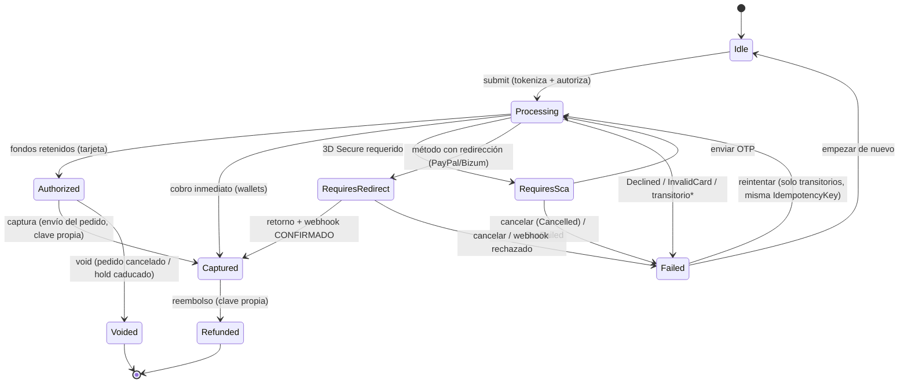

# CheckoutKMP

Flujo de checkout y pagos en Kotlin Multiplatform: tokenización, 3D Secure (SCA), idempotencia, reintentos, accesibilidad y tests de lógica compartida. Lógica **y UI (Compose Multiplatform)** en commonMain; Android e iOS son hosts finos.

> Proyecto de prácticas centrado en el **dominio de pagos**. El objetivo es demostrar
> una arquitectura limpia, testeable y segura (PCI-consciente) para un flujo de pago real,
> con la lógica **y la UI Compose** compartidas en `commonMain`.

---

## Arquitectura

Clean Architecture con la lógica de negocio 100 % en Kotlin común (sin Android):

```
┌──────────────────────────────────────────────────────────┐
│  :androidApp (MainActivity)   ·   iosApp (ComposeView)     │
│  Hosts finos: arrancan Koin y montan App()                 │
└───────────────▲──────────────────────────────────────────┘
                │
┌───────────────┴──────────────────────────────────────────┐
│  :shared / commonMain                                      │
│                                                            │
│   ui/           Compose Multiplatform: App, CheckoutScreen,│
│                 formulario, 3DS, recibo; tema de marca +   │
│                 set de iconos propio; i18n EN/ES en Kotlin │
│   presentation/ MVI: CheckoutState, intents, ViewModel     │
│   domain/       Modelos, PaymentState, casos de uso, Luhn, │
│                 y los CONTRATOS (PaymentRepository,         │
│                 CardTokenizer). Sin Android ni frameworks.  │
│   data/         IMPLEMENTACIONES: FakePsp, FakeCardTokenizer│
│                 (PCI-safe), repositorio + retry, idempotencia│
└──────────────────────────────────────────────────────────┘
```

- **UI + presentación compartidas** (Compose Multiplatform + MVI) en `commonMain`; Android e iOS
  solo hospedan `App()` y arrancan Koin.
- **domain** no depende de la plataforma: modelos, máquina de estados y **contratos**
  (`PaymentRepository`, `CardTokenizer`). **data** los implementa. Regla de dependencia:
  `data → domain ← presentation` (nada apunta hacia data).
- **DI** con **Koin** (`koin-compose` multiplataforma; `initKoin()` común, `androidContext` en la app).
- **i18n en Kotlin** (catálogo type-safe `Strings` + `LocalStrings.current` + `expect deviceLanguageCode()`):
  los Compose *resources* no los empaqueta el plugin KMP-library de AGP 9, así que la localización EN/ES
  se hace en código.
- Targets **iOS activados** (`iosArm64` + `iosSimulatorArm64`, framework `Shared`); `iosMain` aporta
  `MainViewController` (Compose) e `initKoinIos`. La compilación/enlazado Apple **requiere macOS + Xcode**.

## Módulos

| Módulo        | Contenido                                                            |
|---------------|---------------------------------------------------------------------|
| `:shared`     | Todo salvo los hosts: `commonMain` (ui + presentation + domain + data), `commonTest`, `androidMain`, `iosMain`. |
| `:androidApp` | Host Android fino: `Application` (arranca Koin) + `MainActivity` (`setContent { App() }`). |
| `iosApp`      | Host iOS fino (SwiftUI): `ComposeView` monta `MainViewController()`; arranca Koin en `App.init`. |

### Stack

- Kotlin Multiplatform (Kotlin 2.4, AGP 9) · **Compose Multiplatform** (UI compartida) · Gradle version catalogs
- kotlinx-coroutines · kotlinx-datetime 0.7.1 (API `kotlin.time`) · Koin
- `kotlin.uuid.Uuid` (stdlib) para `IdempotencyKey`
- Tests: kotlin-test · kotlinx-coroutines-test · **Turbine**

## Cómo ejecutar

Requisitos: JDK 17+, Android SDK (definido en `local.properties` → `sdk.dir`).

```bash
# Compilar la app Android
./gradlew :androidApp:assembleDebug

# Ejecutar los tests de la lógica compartida (host JVM)
./gradlew :shared:testAndroidHostTest
```

En Android Studio: usa las run configurations del widget de ejecución.

**iOS (requiere macOS + Xcode):** abre `iosApp/iosApp.xcodeproj` en Xcode y ejecútalo; el build embebe
el framework `Shared`. También puedes compilar la lógica para iOS con
`./gradlew :shared:linkDebugFrameworkIosSimulatorArm64` (solo en macOS) o correr sus tests con
`./gradlew :shared:iosSimulatorArm64Test`.

## Roadmap por fases

Cada fase vive en su propia rama (`feat/phase-N-*`) y se mergea a `main` (fast-forward, historia
lineal) tras pasar los tests. `main` siempre compila y pasa tests. **Todas las fases completadas.**

1. ✅ **Dominio** — modelos (`Amount`, `Currency`, `PaymentMethod`, `CardToken`, `IdempotencyKey`,
   `PaymentRequest`, `Receipt`, `PaymentError`), `PaymentState`, `ProcessPaymentUseCase` + `CompleteScaUseCase`,
   Luhn, caducidad con kotlinx-datetime.
2. ✅ **Tests de dominio** — Turbine: Approved / NeedsSca / Declined / Error, Luhn, transiciones de estado.
3. ✅ **Data** — `PaymentRepository`, `FakePsp` configurable con latencia e idempotencia por
   `IdempotencyKey`; `CardTokenizer` PCI-safe. Tests de idempotencia y enmascarado.
4. ✅ **UI Android** — Compose + MVI: selección de método de pago y formulario de tarjeta con
   validación en vivo (Luhn, formateo, enmascarado).
5. ✅ **3D Secure** — pantalla de challenge, OTP simulado, `completeSca`; éxito, `ScaFailed`, cancelación,
   con selector de escenario del PSP en la propia pantalla (demo).
6. ✅ **Accesibilidad** — `liveRegion` (anuncios de estado/errores), `contentDescription` limpio en la
   tarjeta enmascarada, `key(...)` para evitar reanuncios, headings. Sin `traversalIndex`: los layouts son
   lineales y el orden natural ya es correcto.
7. ✅ **Errores y resiliencia** — taxonomía completa de `PaymentError`, mapper PSP→`PaymentError` en el borde,
   `RetryingPaymentRepository` con backoff que solo reintenta transitorios reutilizando la misma
   `IdempotencyKey`; pantalla de fallo accesible con reintento.
8. ✅ **Pulido** — diagrama de la máquina de estados, sección "¿Qué demuestra?", verificación anti-PAN
   (test automatizado + auditoría), `.gitattributes`.

**Mejoras posteriores a las fases** (misma disciplina de rama + `--ff-only`): migración de fechas a
`kotlin.time` (kotlinx-datetime 0.7.1) eliminando deprecaciones; centralización de constantes y
duplicaciones (`CardRules`, `DemoDefaults`, `ScaChallenge`); y **rediseño de UI de marca** (tema
Material3 claro/oscuro + set de iconos propio) verificado en emulador en los cuatro estados.

**Roadmap retail e-commerce** (fases 9–14, checkout tipo moda/retail):

9. ✅ **Autorización vs captura** — en retail se **autoriza** en el checkout (fondos retenidos) y se
   **captura** al enviar el pedido. `PaymentState` separa `Authorized` / `Captured` / `Refunded`;
   `CapturePaymentUseCase` y `RefundPaymentUseCase` puros; `FakePsp` con authorize/capture/refund,
   **cada operación con su propia idempotencia**; el momento de cobro es una **propiedad del método**
   (`capturesImmediately`: tarjeta difiere la captura, wallets cobran en un paso y nunca pasan por
   `Authorized`). El recibo distingue "Autorizado (se cobrará al enviar)" de "Cobrado", con botones
   demo de envío del pedido y reembolso.
10. ✅ **Tarjeta regalo y pago parcial** — split tender estilo Zara: la tarjeta regalo se aplica
    **primero** (`planSplit`, tope en su saldo) y la tarjeta bancaria solo cobra el **restante**; si
    el saldo cubre el total, no hay tarjeta **ni 3D Secure**. `GiftCardService` (redeem/reverse,
    idempotencia por operación) + `ProcessSplitPaymentUseCase`, una **saga con compensación**: si la
    tarjeta es rechazada tras consumir el saldo, la redención se **revierte**; los fallos transitorios
    no compensan (reintentar reejecuta la saga con las mismas claves y la redención se replay-a
    idempotente). El reembolso devuelve **cada tender a su origen** (PSP + reversa del saldo).
11. ✅ **Métodos con redirección** — PayPal/Bizum: el PSP crea la orden (`RequiresRedirect(url,
    returnUrl)`), el usuario aprueba en el proveedor y vuelve por deep link. **El retorno es solo un
    indicio**: `CompleteRedirectUseCase` reconcilia el retorno contra el **webhook** simulado en
    `FakePsp` (registrado al crear la orden, invisible para el cliente). Un retorno "aprobado" cuyo
    webhook fue rechazado **falla y nunca cobra**; cancelar mapea a `Cancelled`; el cobro solo ocurre
    cuando el proveedor confirma (y directo a `Captured`, sin pasar por `Authorized`).
12. ✅ **Elegibilidad por método** — cada método declara su `AfterSalesPolicy` (`canChangeSize`,
    `canRefundToOrigin`): el medio de pago condiciona el negocio post-venta, no solo el cobro (el
    detalle real de Zara: sin cambio de talla si pagaste con PayPal/Bizum). El recibo muestra la
    elegibilidad y el botón de reembolso solo existe si el método admite reembolso al origen.
13. ✅ **Void de autorizaciones** — cancelar el pedido antes del envío **libera la retención sin
    cobrar** (`Authorized → Voided`): un void no es un reembolso (el reembolso devuelve un cargo;
    el void suelta dinero solo reservado). `VoidAuthorizationUseCase` con su propia idempotencia;
    un hold anulado no se puede capturar ni reembolsar, y un cargo capturado no se puede anular.
    Además, **la retención caduca**: pasada la ventana de validez del PSP (7 días simulados), la
    captura se rechaza (`authorization_expired`) y el hold queda liberado — como en las redes reales.
14. ✅ **Histórico de pedidos** — cada pago liquidado se registra en `OrderHistory` (contrato de
    dominio; `InMemoryOrderHistory` en data, sesión). El registro hace **upsert por `paymentId`**:
    capturas, reembolsos y voids actualizan el mismo pedido, ordenado por última actualización. El
    estado mostrado se **deriva del recibo** (`Receipt.settlement`: autorizado/cobrado/reembolsado/
    cancelado). Pantalla de histórico navegable desde el checkout (sin librería de navegación: la
    selección vive izada en la ruta), con lista, importe, método y fecha, y **detalle por pedido**
    al tocar una fila: mismo recibo itemizado del checkout + **cronología** del ciclo de vida
    (autorizado/cobrado/reembolsado/cancelado con sus fechas), seleccionado por `paymentId` para
    seguir "vivo" si el pedido cambia. Recibos PCI-safe por construcción: el histórico tampoco
    contiene nunca un PAN.

**Ronda de pulido UX** (misma disciplina de rama + `--ff-only`, verificada en emulador): fecha/hora
en el recibo (`Receipt.createdAt` vía el seam de `Clock`); **OTP de 3D Secure en celdas segmentadas**
sobre un único `BasicTextField` (se anuncia como un solo campo) con **reenvío de código** y cuenta
atrás gobernada por el ViewModel; **autofill** (`ContentType` de tarjeta/caducidad/CVV y SMS-OTP);
**copiar al portapapeles** el `paymentId`/`authCode` del recibo (expect/actual, solo identificadores);
icono de marca dinámico en el campo de tarjeta; y unificación de los CTA de pago en `PayCta` con el
importe en todos los botones.

## Máquina de estados del pago



\* Los errores **transitorios** (`Network` / `Timeout` / `RateLimited`) se reintentan automáticamente
con backoff exponencial en la capa data **antes** de aflorar como `Failed`; el reintento manual reejecuta
con la **misma** `IdempotencyKey`.

## ¿Qué demuestra este proyecto?

- **Seguridad PCI-consciente (regla de oro):** el **PAN nunca se loguea, ni se persiste, ni aparece
  en el estado**. Solo circula el **token** y una versión **enmascarada** (p. ej. `•••• 4242`). Verificado
  con un test automatizado (`GoldenRuleTest` / `GoldenRuleStateTest`) y sin ningún logging en el código.
- **Idempotencia por operación:** autorización, captura y reembolso llevan cada uno su propia
  `IdempotencyKey`; reintentar cualquiera de ellos no cobra (ni devuelve) dos veces.
- **Autorización vs captura:** el cobro real se difiere al envío del pedido; los métodos de cobro
  inmediato (wallets) lo declaran como propiedad (`capturesImmediately`) y nunca pasan por `Authorized`.
- **Reintentos seguros:** solo se reintentan errores **transitorios** (red/timeout/rate-limit), nunca
  `Declined` ni `InvalidCard`, y siempre con la **misma** `IdempotencyKey`.
- **3D Secure / SCA:** máquina de estados que modela el challenge y su resolución (éxito/fallo/cancelación).
- **Validación de tarjeta:** algoritmo de **Luhn** y control de caducidad, testeados en `commonTest`.
- **Lógica compartida y testeada:** casos de uso puros, independientes de Android, verificables con Turbine.
  **~180 tests** entre `commonTest` (dominio + data) y los tests JVM de la app (ViewModel + DI).
- **Accesibilidad de verdad:** anuncios de errores/resultado (`liveRegion`), descripciones de contenido
  y navegación por headings.
- **UI compartida (Compose Multiplatform):** una sola UI Compose (`commonMain/ui`) para Android e iOS;
  los hosts solo montan `App()` y arrancan Koin.
- **Sistema de diseño de marca:** tema Material3 propio (claro y oscuro) con la paleta extraída del
  icono de la app (degradado violeta→azul→teal) en `Theme.kt` — sin *dynamic color*, para que UI e
  icono se lean como un solo producto — más un **set de iconos vectoriales propio** (`CheckoutIcons`,
  `ImageVector` en `commonMain`) que se renderiza idéntico en Android/iOS sin la dependencia
  `material-icons-extended` (deprecada en Compose MP).
- **Internacionalización:** UI localizada **EN/ES** con un catálogo type-safe `Strings` en Kotlin
  (`LocalStrings.current`; los Compose resources no los empaqueta el plugin KMP-library de AGP 9); los
  mensajes de error nunca filtran códigos técnicos.
- **Higiene de código:** sin números mágicos (reglas de tarjeta en `CardRules`, dimensiones/tokens de
  UI en `Dimens`, credenciales de demo en `DemoDefaults`), sin duplicación hardcodeada, **sin APIs
  deprecadas** (fechas migradas a `kotlin.time` con kotlinx-datetime 0.7.1) y con la regla de
  dependencia de Clean Architecture respetada.

---

Aprende más sobre [Kotlin Multiplatform](https://www.jetbrains.com/help/kotlin-multiplatform-dev/get-started.html).
